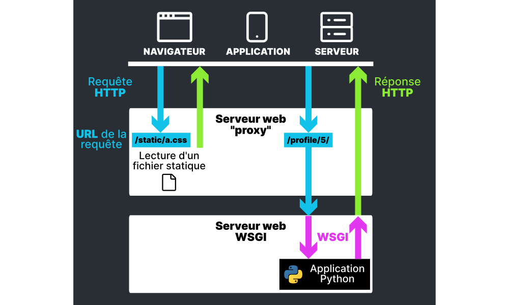
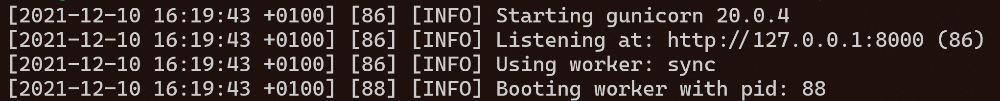

# Mettre en production un projet Django

Contrairement au processus de développement d'un projet Django, il y a plusieurs choses qui changent lorsqu'il est temps de le déployer en production.

Pour rappel, voici des exemples de serveurs permettant d'installer une application Python (et donc Django) :

* [**Gandi Cloud**](https://www.gandi.net/fr/cloud/vps) ● V-R1 ● 6€ par mois
* [**Vultr**](https://www.vultr.com/products/cloud-compute/) ● Cloud Compute ● 3,5$ par mois
* [**OVH**](https://www.ovhcloud.com/fr/vps/) ● VPS Starter ● 3,6€ par mois (n'oubliez pas les backups automatiques en cas d'incendie)

Tout d'abord, ce n'est pas le fichier `manage.py` qui sera utilisé afin d'exécuter votre projet, mais au choix le fichier `wsgi.py` ou `asgi.py` qui sont également des **points d'entrée** de notre projet Django.

Sur votre serveur, il faudra d'abord utiliser un **serveur web WSGI** qui exécutera le code Python de votre projet Django. Le plus connu s'appelle [**Gunicorn**](https://gunicorn.org/). C'est à ce dernier que vous donnerez le chemin menant vers le fichier `wsgi.py` de votre projet afin qu'il puisse l'exécuter.

**WSGI**, ou "Web Server Gateway Interface", est une interface permettant à des projets Python, donc du code dynamique (à l'instar de PHP ou Java), d'être exécutés par des serveurs web dédiés à cet effet. **ASGI**, pour "Asynchronous Server Gateway Interface", est une interface plus récente mais conçue pour des serveurs web et des projets qui peuvent fonctionner ensemble de façon **asynchrone**.

En plus de cela, il vous faudra un **serveur web** tel que [Apache](https://httpd.apache.org/), [Nginx](https://www.nginx.com/) ou encore [Caddy](https://caddyserver.com/). Vu que son principal but est de rediriger les requêtes HTTP reçues vers le serveur web WSGI, on peut dire que c'est un **serveur web "proxy"**. Il réalisera donc deux choses :

* Transmettre les requêtes HTTP reçues au serveur web WSGI, qui exécute votre projet Django
* Servir lui-même les fichiers statiques de votre projet Django, qui auront été compilés à l'avance dans un dossier spécifique

Voici ce qu'il vous faudra faire dans l'ordre pour avoir une mise en production complète :

1. Commander si possible un serveur avec un accès complet à son système d'exploitation (baremetal, VPS...)
2. Commander un nom de domaine et le faire pointer sur votre serveur (A, CNAME)
3. Préparer votre configuration Django pour l'environnement de production
4. Transférer votre projet Django sur votre serveur
5. Compiler les fichiers statiques de votre projet Django, toujours sur votre serveur
6. Ouvrir les ports nécessaires sur le pare-feu de votre serveur (80, 443)
7. Installer et paramétrer le serveur web WSGI (éventuellement en tant que service)
8. Installer et paramétrer un serveur web proxy (éventuellement en tant que service)
9. Si nécessaire, installer et paramétrer une base de données (éventuellement en tant que service)
10. Terminer la mise en place de votre projet Django
11. Que faire lors d'une update de votre site (compilation de statiques, gunicorn à reset si settings changés, migrations à appliquer si bdd changée)



## 1) La configuration

Tout d'abord, il est **essentiel** d'avoir des paramètres séparés entre votre environnement de développement et votre environnement de développement.

Un fichier contiendra les paramètres communs à tous les environnements, comme par exemple `base.py`, puis un fichier `prod.py` contiendra les paramètres uniquement dédiés à l'environnement de production après avoir importé tout ce qui est écrit dans `base.py`.

Même s'il y a des variables déjà renseignées dans le fichier de configuration **"de base"**, le fait de les réécrire dans le fichier de configuration de **production** écrasera donc les valeurs précédentes.

Dans les paramètres de production, veillez particulièrement à désactiver le mode debug de Django comme ceci :

```python
DEBUG = False
```

Définissez le dossier où seront compilés, sur votre serveur, tous les fichiers statiques de votre projet Django. Il vous faudra donc connaître à l'avance le répertoire où pourront être stockés les fichiers.

```python
STATIC_ROOT = "/home/server/projetdjango/staticfiles/"
```

Aussi un répertoire de votre serveur à préciser à Django, c'est là où seront enregistrés les éventuels fichiers uploadés par les utilisateurs de votre projet Django :

```python
MEDIA_ROOT = "/home/server/projetdjango/media/"
```

Si vous utilisez une base de données, réécrivez entièrement la variable `DATABASES` avec cette fois-ci les informations de connexion à la base de données installée sur votre serveur :

```python
DATABASES = {
    "default": {
        "ENGINE": "django.db.backends.mysql",
        'NAME': "[nom de la base de données]",
        "USER": "[utilisateur de la base de données]",
        "PASSWORD": "[mot de passe de la base de données]",
        "HOST": "127.0.0.1",
        "PORT": "[port de la base de données]",
    }
}
```

Pour finir, ajoutez le nom de domaine de votre site web au sein de la liste des "sites autorisés" :

```python
ALLOWED_HOSTS = [
    "www.monsiteweb.fr"
]
```

Ce fichier de paramètres devra être correctement référencé dans les fichiers `wsgi.py` et `asgi.py`. Par exemple, pour utiliser le fichier `mainapp/settings/prod.py`, il faudra avoir une ligne comme ceci :

```python
os.environ.setdefault('DJANGO_SETTINGS_MODULE', 'mainapp.settings.prod')
```

## 2) L'upload

Afin de copier les fichiers de votre projet Django sur votre serveur, la manière recommandée est de passer par le protocole **SFTP** (SSH File Transfer Protocol). Comme son nom l'indique, ce dernier passe par le protocole sécurisé **SSH** agin de pouvoir transférer des fichiers avec votre serveur : il vous faudra donc un accès **SSH** à l'aide d'une **clé** ou bien d'un **utilisateur/mot de passe**.

Pour des raisons historiques, certains hébergeurs continuent de proposer des accès **FTP** à leurs serveurs : ce protocole est hautement insécurisé et il est fortement déconseillé de s'en servir depuis déjà de nombreuses années.

Voici des applications recommandées afin de réaliser des transferts **SFTP** :

* [WinSCP](https://winscp.net/eng/index.php) (Windows)
* [Cyberduck](https://cyberduck.io/) (Windows, macOS)
* [FileZilla Client](https://filezilla-project.org/download.php?type=client) (Windows, macOS, Linux)

Pour un serveur fonctionnant avec une distribution Linux, vous devrez alors uploader vos fichiers au sein d'un répertoire utilisateur. Par exemple, si vous avez l'utilisateur `server`, son répertoire utilisateur est `/home/server/`.

## 3) Les fichiers statiques

Contrairement au serveur web léger qui est exécuté lorsque vous faites un `manage.py runserver`, les fichiers statiques de votre projet Django ne seront pas gérés par le **serveur web WSGI**. D'où la nécessité d'avoir dans tous les cas un **serveur web** qui puisse aller chercher puis renvoyer les fichiers statiques lorsque demandés par un visiteur.

Juste avant la mise en production, exécutez cette commande afin de collecter et compiler tous les fichiers statiques de votre projet Django dans un dossier séparé. N'oubliez pas l'argument `settings` pour utiliser vos paramètres de production. Votre **serveur web** devra donc utiliser ce dossier lorsqu'il voudra renvoyer un fichier statique.

```sh
python manage.py collectstatic --settings=mainapp.settings.prod
```

## 4) Le serveur web WSGI

Pour l'exemple de Gunicorn, ce dernier s'installe rapidement à l'aide de pip tel qu'expliqué dans la [documentation Django](https://docs.djangoproject.com/fr/3.2/howto/deployment/wsgi/gunicorn/).

Une fois installé, l'idéal est de le faire tourner en tant que **service**. Un service est une application tournant en tâche de fond, pouvant être facilement monitorée, démarrée, arrêtée, etc. Les façons de faire tourner des services changent selon le **système d'exploitation** de votre serveur, même à travers plusieurs distrubutions Linux. La [documentation Gunicorn](https://docs.gunicorn.org/en/stable/deploy.html#monitoring) vous aidera à créer et lancer un service selon ce qui est utilisé par votre serveur.

Avant d'exécuter Gunicorn, il faudra aller dans le dossier de votre **projet** Django (là où se trouve le `manage.py`), puis ensuite l'exécuter en passant le chemin vers le module **wsgi** de votre **application**.

Par exemple, pour un projet situé dans le chemin `/home/server/projetdjango/` avec un fichier `wsgi.py` situé dans le chemin `/home/server/projetdjango/mainapp/wsgi.py` :

```sh
cd /home/server/projetdjango/
gunicorn mainapp.wsgi
```

Le serveur web WSGI restera en cours d'exécution sur le port qu'il vous affichera dans le terminal, par exemple ici sur le port 8000 :



Lorsqu'il recevra une requête HTTP, il passera par l'interface WSGI pour la transmettre à votre application Python, puis retournera une réponse HTTP avec ce que l'application Python aura renvoyé.

## 5) Le serveur web "proxy"

Il est désormais temps d'installer un serveur web "proxy". Le plus simple et rapide à configurer, en plus de proposer des certificats HTTPS automatiques grâce à [Let's Encrypt](https://letsencrypt.org/fr/), est probablement [Caddy](https://caddyserver.com/).

Voici un exemple de fichier de configuration Caddyfile. Il vous faudra remplacer les choses suivantes selon votre cas réel :

* À la première ligne, à la place de `www.monsiteweb.fr`, écrivez le ou les noms de domaines sur lesquels votre projet Django sera accessible.
* Sur la première directive **root**, le chemin `/home/server/projetdjango/staticfiles/` doit pointer sur le dossier correspondant au paramètre `STATIC_ROOT` du projet Django
* Sur la seconde directive **root**, le chemin `/home/server/projetdjango/media/` doit pointer sur le dossier correspondant au paramètre `MEDIA_ROOT` du projet Django
* Sur la ligne de la directive **reverse_proxy**, le port de l'adresse `127.0.0.1:8000` doit correspondre au port sur lequel tourne **Gunicorn**.

```caddyfile
www.monsiteweb.fr {
    handle_path /static/* {
        root * /home/server/projetdjango/staticfiles/
        file_server
    }
    handle_path /media/* {
        root * /home/server/projetdjango/media/
        file_server
    }
    reverse_proxy 127.0.0.1:8000
    header {
        header_up Host {http.request.host}
        header_up X-Forwarded-For {http.request.remote.host}
        header_up X-Forwarded-Proto {http.request.scheme}
    }
}
```

Si vous souhaitez laisser tourner Caddy en fond [en tant que service](https://caddyserver.com/docs/running#linux-service), cette configuration sera à écrire au sein du fichier `/etc/caddy/Caddyfile`.

## 6) Les autres services

Il vous faudra ensuite certainement démarrer une **base de données** qui sera utilisée par votre projet Django. Référez-vous à la documentation de la base de données utilisée pour la laisser tourner en tant que **service**, par exemple.

## 7) Derniers préparatifs du projet Django

Il reste certaines choses à réaliser pour que votre projet Django soit utilisable.

La première chose, exactement comme lorsque l'on développe notre projet, consiste à préparer notre base de données. Des migrations sont censées être déjà présentes dans votre projet, il ne vous reste donc plus qu'à les appliquer :

```sh
python manage.py migrate --settings=mainapp.settings.prod
```

Si vous aviez exporté les données de votre base de donnée de **développement** afin de les importer dans la base de données de **production**, alors il vous faudra appeler la commande servant à charger des [instantanés](https://docs.djangoproject.com/fr/3.2/howto/initial-data/#providing-initial-data-for-models). Par exemple, pour un instantané qui s'appelle `data.json` :

```sh
python manage.py loaddata data.json --settings=mainapp.settings.prod
```

Si vous avez besoin d'accéder à l'interface d'administration Django, peut-être que votre instantané contenait les informations des utilisateurs déjà existant sur votre projet en mode **développement**. Si c'est le cas, pensez à changer leurs mots de passe en **production** par sécurité. Par exemple, pour changer le mot de passe de l'utilisateur `test` :

```sh
python manage.py changepassword test --settings=mainapp.settings.prod
```

Si ce n'est pas le cas, vous devrez utiliser cette commande en **production** afin de créer un 1er utilisateur avec des droits d'administrateur :

```sh
python manage.py createsuperuser --settings=mainapp.settings.prod
```
