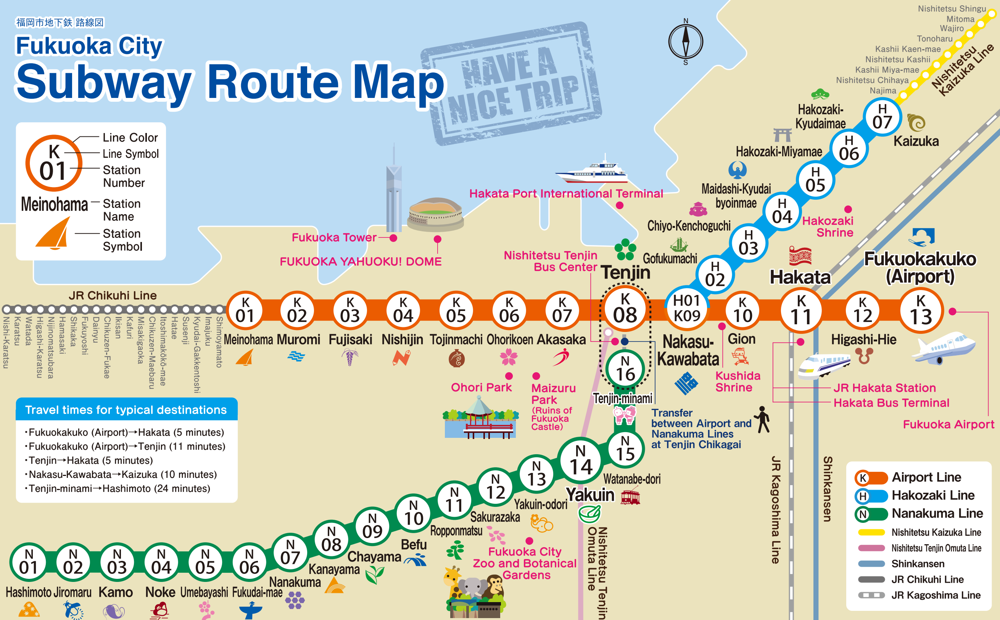

# Exercice "Billetterie"

👉 À réaliser après avoir lu le cours "Introduction 1"

## 📜 Situation

Le métro municipal de la ville de [Fukuoka](https://fr.wikipedia.org/wiki/Fukuoka), au sud-ouest du Japon, possède 3 lignes. La ligne la plus importante, la "Airport Line" est celle qui nous intéressera ici.

Les machines de billetterie actuelles nécessitent de regarder sur une carte, dans la station où vous vous trouvez, votre station de destination pour connaître le prix de votre billet. Ce n'est pas très pratique !

Pour avoir un système de billetterie utilisable par le personnel de gare en cas de panne générale, on vous charge de coder un nouveau système rudimentaire mais efficace pouvant fonctionner dans un terminal - et donc à distance en utilisant SSH, si besoin.

Les tarifs dans le ferroviaire sont souvent sont calculés selon la // distance parcourue, en y //additionnant des frais de service de base. Pour sa part, le métro de Fukuoka a simplifié cela en définissant plusieurs zones correspondant à un intervalle de distance et un tarif unique.

Le tarif réduit, pour enfants ou personnes handicapées, correspond toujours à la moitié du tarif adulte, sauf pour le tarif enfant de la première zone qui est à 110 yen.

Voici le tableau des zones tarifaires que l'on trouve sur la Airport Line, avec les prix en yen :

Zone   | Distance    | Tarif plein (tarif réduit)
------ | ----------- | --------------------------
Zone 1 | 0 à 3 km    | 210 (110)
Zone 2 | 3.1 à 7km   | 260 (130)
Zone 3 | 7.1 à 11km  | 300 (150)
Zone 4 | 11.1 à 15km | 340 (170)

Tiré de la [grille tarifaire officielle](https://subway.city.fukuoka.lg.jp/eng/fare/deta/fare_table.pdf).

## 🏁 Objectifs

Le but est de poser quelques questions à l'utilisateur pour calculer ce qu'il devra payer au total, et ce selon les règles tarifaires de la compagnie.

On peut d'abord lui demander combien de billets adulte il désire, puis s'il désire des billets à tarif réduit, et si oui, combien de billets à tarif réduit.

Ensuite, il faudra lui demander la station de départ et d'arrivée de son itinéraire. Pour éviter les fautes de frappe et profiter du fait que chaque station ait déjà un numéro officiel, on affichera la liste des stations avec le numéro à taper pour en choisir une.

On peut alors déterminer la zone tarifaire à appliquer aux billets demandés, en calculant la distance kilométrique entre la station de départ et celle d'arrivée. Pour cela, un dictionnaire est déjà disponible, chaque entrée ayant pour clé le nom de la station, et pour valeur la distance kilométrique jusqu'à la station suivante. Meinohama est donc à 1.5km de Muromi, etc.

Pour terminer, on affichera tout le détail des calculs (nombre de billets, prix unitaire, zone tarifaire), puis le coût total, et enfin la voie du train qu'il devra emprunter : voie 1 dans le sens Meinohama > Fukuokafuko, et voie 2 dans le sens inverse.

J'ai commencé à écrire quelques variables au début du script, mais il faudra peut-être en déclarer d'autres qui seront utiles au long du code. Il ne faut cependant pas modifier les valeurs du dictionnaire contenant les stations et les distances.

En cas d'erreur, vous pouvez laisser le script crasher. Cela peut arriver si le nombre de billets voulu est négatif, etc... n'essayez pas de trop blinder votre code contre les bugs pour l'instant, l'important est d'avoir une logique fonctionnelle pour ce premier exercice.

Vous pouvez tout de même gérer des cas d'erreurs logiques, comme par exemple si l'itinéraire commence et termine au même endroit, il n'y aura alors besoin de rien calculer et le script pourra s'arrêter.

## ⭕ Conditions de réussite

- ✔️ On peut acheter des billets adultes et/ou enfant
- ✔️ On peut aller d'un sens (Meinohama > Fukuokakuko) ou dans l'autre sens (Fukuokakuko > Meinohama)
- ✔️ On voit le détail de l'itinéraire (distance, zone) et le calcul du coût total à payer

## ☝ Conseils

Avant d'essayer d'avoir un affichage soigné dans le terminal, commencez d'abord par correctement coder toute la logique nécessaire au bon fonctionnement du script. Testez longuement votre programme avec différents cas possibles, et pour vérifier que votre itinéraire possède le bon nombre de kilomètres et le bon prix, vous pouvez simplement utiliser un vrai calculateur d'itinéraires comme Google Maps ou [Hyperdia](http://www.hyperdia.com/).

N'oubliez pas que la ligne de métro est une simple suite de stations, que l'on peut parcourir dans un sens ou dans l'autre.

Pour chaque "question" posée à l'utilisateur, il faudrait idéalement n'utiliser qu'une seule fois la fonction `input()`. Vous pourriez être tenté d'en utiliser plusieurs si vous essayez d'utiliser une boucle `while`, ce qui reste grandement optionnel pour cet exercice.

Il y a bien sûr plusieurs façons de calculer la distance de l'itinéraire. Vu que l'on demande des numéros de stations à l'utilisateur, cela peut aider au fait que l'on doive parcourir le dictionnaire des stations et de leur distance dans un sens donné... Pensez aussi qu'un itinéraire peut aller dans la direction Meinohama > Fukuokakuko, ou bien dans la direction inverse : le calcul sera sûrement différent dans ce cas là.

Si vous hésitez sur plusieurs façons de coder une idée en tête, n'hésitez pas à l'écrire pas à pas, quitte à avoir de nombreuses lignes ou variables - vous pourrez toujours optimiser après coup une fois que cela fonctionne. C'est avec de l'expérience que vous finirez par écrire du code concis du premier coup !
