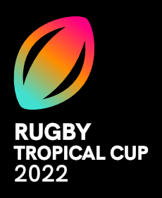

# Exercice "Rugby"

👉 À réaliser après avoir lu le cours "Intermédiaire 2"

## 📜 Situation

Nouvelle compétition de Rugby mettant en concurrence des équipes nationales, la **Rugby Tropical Cup** aura lieue pour la première fois en 2022. Ce sera un tournoi à élimination directe.

La première édition se déroulera intégralement en Nouvelle-Zélande à travers plusieurs de ses villes. Pour le moment, seuls quelques pays sont en compétition : Nouvelle-Zélande, Australie, Japon, Fidji, Samoa, Tonga, Afrique du Sud et Russie.

N'étant pas encore de grande envergure, la compétition fait appel à une startup spécialisée dans la billetterie pour s'occuper de l'édition des billets selon les commandes passées sur son site e-commerce.

Le tournoi se déroule comme ceci :

Date            | Match                  | Affiche
--------------- | ---------------------- | ---------------------
2 Juillet 2022  | Quart de finale A      | Nouvelle-Zélande vs Russie (Quart de finale A)
3 Juillet 2022  | Quart de finale B      | Japon vs Australie
5 Juillet 2022  | Quart de finale C      | Samoa vs Afrique du Sud
6 Juillet 2022  | Quart de finale D      | Tonga vs Fidji
9 Juillet 2022  | Demi-finale            | Vainqueur Quart A vs Vainqueur Quart B
10 Juillet 2022 | Demi-finale            | Vainqueur Quart C vs Vainqueur Quart D
12 Juillet 2022 | Match pour la 3e place |
12 Juillet 2022 | Finale                 |

Pour ce qui est des billets, ils sont vendus selon 3 catégories, avec plusieurs choix de devises pour faciliter l'achat à l'international (dollar néo-zélandais, euro, yen japonais) :

Catégorie   | Placement | Prix NZD | Prix EUR | Prix JPY
----------- | --------- | -------- | -------- | --------
Catégorie C | Libre     | 65 NZD   | 39 EUR   | 5000 JPY
Catégorie B | Attribué  | 80 NZD   | 48 EUR   | 6200 JPY
Catégorie A | Attribué  | 100 NZD  | 60 EUR   | 7800 JPY

## 🏁 Objectifs

Vous êtes en charge de la génération des billets dans leur version française. Pour cela, l'entreprise en charge de l'impression des billets vous a fourni plusieurs choses :

* Un export des tables de leur base de données, au format JSON
* L'image de fond à utiliser pour les billets

### Formatage des données

Vu que l'API permettant de récupérer ces informations en temps réel n'existe pas encore, on vous a fourni des extraits de la base de données sous forme de documents JSON, chaque fichier correspondant à une table :

* `stadiums.json` contient la liste des stades utilisés lors du tournoi
* `events.json` contient la liste des matchs
* `tickets.json` contient la liste des billets à éditer

Vous y retrouverez notamment les ID (clés étrangères) utilisés dans la base de données pour faire référence à d'autres tables. `event_id` sur un élément du fichier `tickets.json` fera donc référence à un match du fichier `events.json`.

Pour identifier chaque tickets, utiliser un simple nombre qui s'auto-incrémente aurait été délicat car trop simple à deviner, facilitant la fraude aux faux billets. On utilise à la place des [**UUID**](https://fr.wikipedia.org/wiki/Universally_unique_identifier) pour numéroter chaque billet, la base de donnée d'origine [(PostgreSQL)](https://www.postgresql.org/docs/current/datatype-uuid.html) s'occupant d'éviter l'insertion tout doublon.

### Écriture sur le billet

Votre tâche sera d'abord de lire les trois documents JSON, puis de boucler sur chaque billet pour ouvrir l'image de fond, y écrire le texte correspondant aux détails, y appliquer le QR Code, puis sauvegarder dans le dossier `tickets`.

Pour le texte à imprimer sur le billet, il faudra impérativement utiliser la police d'écriture de la charte graphique du tournoi, à savoir **HK Grotesk**. Le lieu, la date et l'heure du match devront être écrits en noir et avec "HK Grotesk Black", quand les autres textes devront être écrits en blanc avec "HK Grotesk Medium". L'entreprise vous a fourni les fichiers à utiliser, dans le dossier `fonts`.

Vous partez de données formatées en anglais (sauf pour le nom des équipes) et il faudra donc prendre en compte cela. Les dates sont stockées au format Mois-Jour-Annee et devront être affichées à la française, un placement "free" devra être affiché "Libre".

Le code-barres bidimensionnel de type **QR Code** a été choisi pour assurer un scan rapide des billets, qu'ils soient imprimés ou présentés sur un smartphone. Son contenu devra simplement correspondre à l'ID du billet.

Pour cela, on vous propose d'installer et d'utiliser la bibliothèque Python `qrcode` dont la documentation est sur [PyPI](https://pypi.org/project/qrcode/). Son usage n'est pas très complexe, mais on vous a fourni un exemple fonctionnel dans le fichier `test_qr.py`.

Enfin, l'entreprise d'impression vous a envoyé les positions x,y de chaque texte ainsi que celles du QR Code :

* 645, 105 : Équipe domicile (1ere ligne)
* 645, 230 : Équipe extérieur (2nde ligne)
* 620, 353 : Lieu de match
* 575, 470 : Date du match
* 1170, 470 : Heure du match
* 525, 586 : Placement
* 835, 586 : Catégorie
* 1045, 586 : Prix du billet
* 1340, 365 : QR Code

## ☝ Conseils

Faites attention, lors de l'écriture de votre code, à ne pas trop mélanger anglais et français, et à utiliser le bon lexique selon la langue : "billet" en français mais "ticket" en anglais, etc. Dans le cas présent, les données qui vous sont fournies sont en anglais, et il vaut mieux s'en tenir à l'anglais lorsque l'on travaille avec un partenaire international. (Vous pouvez garder les commentaires en français, ça reste un exercice !)
