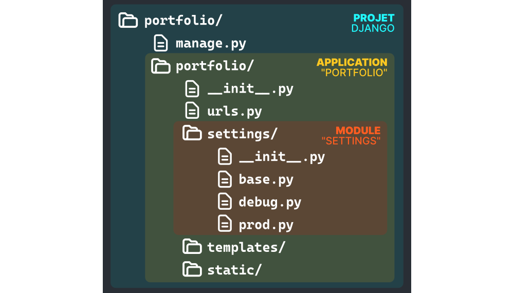

# L'architecture de Django

> Exemple de la hiérarchie d'un projet Django

## Les projets

Le répertoire racine dans lequel se trouve tout votre code est tout simplement votre **projet**](https://docs.djangoproject.com/fr/3.2/glossary/#term-project) utilisant Django.

C'est le répertoire racine dans lequel se trouve l'intégralité de votre code, comme par exemple le fichier `manage.py`. Il s'y trouve aussi à l'intérieur, un dossier du même nom que le projet, qui contient des choses très importantes comme les **settings** ou les **URLs**.

On peut créer un projet à tout moment à l'aide de la commande `django-admin startproject`.

## Les applications

Au sein d'un **projet** se trouve généralement une ou plusieurs [**applications**](https://docs.djangoproject.com/fr/3.2/ref/applications/) (sauf dans les projets d'exemple "minimal" de ce dépôt).

Une **application** sert à regrouper de nombreuses choses majeures : les **vues**, les **modèles**, les **URLs**... Certaines de ces fonctionnalités proposées par Django nécessitent de se trouver dans une application pour fonctionner.

On peut séparer la logique de notre code en plusieurs applications dans les cas où cela a du sens, mais ce n'est pas obligatoire du tout.

Chaque application aura alors un dossier à son nom, au sein du dossier de votre projet Django. C'est grâce à ce nom que vous pourrez faire référence à cette application depuis n'importe où dans le code source de votre projet.

Pour importer la **vue** `HomeView` de l'application `website`, on pourra donc écrire de n'importe où :

    from website.views import HomeView

## Les applications "contrib"

Django propose également lui-même de nombreuses applications que l'on peut décider d'utiliser ou non dans notre projet : ce sont les [**applications contrib**](https://docs.djangoproject.com/fr/3.2/ref/contrib/). L'interface d'administration auto-générée, ou encore la gestion des fichiers statiques, sont des applications contrib.

Pour utiliser une application contib au sein d'un projet Django, il faut le ajouter au paramètre `INSTALLED_APPS` des paramètres.

## Les modules

Pour mieux découper certaines composants de votre projet, comme les **modèles** ou les **vues**, on peut passer d'un fichier unique à un dossier contenant plusieurs fichiers.

En Python, un fichier ou bien un dossier qui peut être importé par un autre fichier s'appelle un **module**.

Partons par exemple d'un fichier `views.py` qui contient deux classes, `HomeView` et `AboutView`. On veut que chaque classe soit rangée dans son propre fichier.

On crée alors un dossier `views/` au même endroit que l'actuel fichier, et dans ce dossier, on crée un fichier vide `__init__.py` qui sert à indiquer au langage Python que le dossier dans lequel il se trouve est un **module**.

Un nouveau fichier `home.py` contiendra alors la classe `HomeView`, et un nouveau fichier `about.py` contiendra la classe `AboutView`. Cependant, pour que l'on puisse importer les classes de ces fichiers, il faut d'abord les importer au sein du fichier `__init__.py` comme ceci :

    from .home import HomeView
    from .about import AboutView
