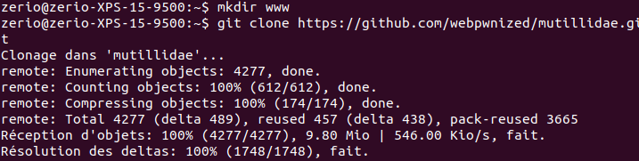
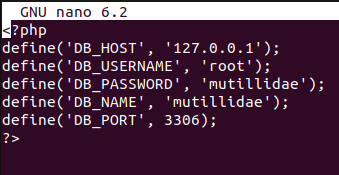
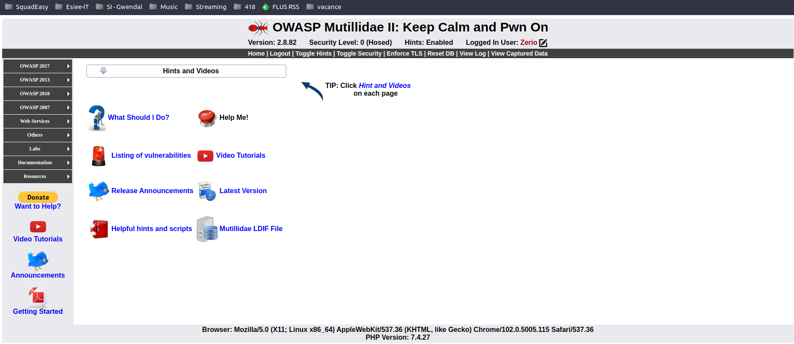

## Mission : Installation Mutillidae

#### Définition :
**Mutillidae est un site web conçu pour identifier et tester les failles de sécurité. De plus, il est possible de déterminer le niveau de sécurité appliqué pour chacunes des failles.**

**- 1 : Connexion à notre espace Alwaysdata et SSH via Gitbash**

ssh pruny@ssh-pruny.always.data.net

**- 2 : Clone Mutillidae**

Tout d'abord, il faut se rendre sur le dossier prévu pour les applications web : `/home/user/www` pour ensuite pourvoir cloner le dépôt et installer Mutillidae au bon endroit : `git clone https://github.com/webpwnized/mutillidae.git`. Un dossier va donc être créé et accessible via : `https://pruny.alwaysdata.net/mutillidae/`

**- 3 : Ouvrir l'accès à Mutillidae**

L'application web est cependant bloqué. En effet, on ne doit pas laisser sur le web, l'accès à une application web aussi défaillante. OWASP a donc bloqué les accès des clients extérieurs (accès via internet)

mv .htacces no.htacces

**- 4 : Ouvrir l'accès à Mutillidae**

On créer par la suite une base de données MySQL dédiée et un utilisateur sur le profil Alwaysdata :
- Nom Base de donnée : pruny
- Utilisateur Base de donnée : pruny_multilidae
- Mot de passe : "* * * *"

**- 5 : Modifications de la base de donnée**
Il faut maintenant compléter correctement le fichier de configuration suivant : `/home/user/www/mutillidae/includes/database-config.inc`. Pour cela, on entre la commande : `nano database-config.inc`

**- 6 : Utilisation de Mutillidae**

Une fois toutes les étapes compléter, l'application web Mutillidae est enfin utilisable 

**Il ne faut pas oublier de rebloquer l'application à la fin de chaque utilisation en renommant le fichier no.htaccess en .htaccess !**
